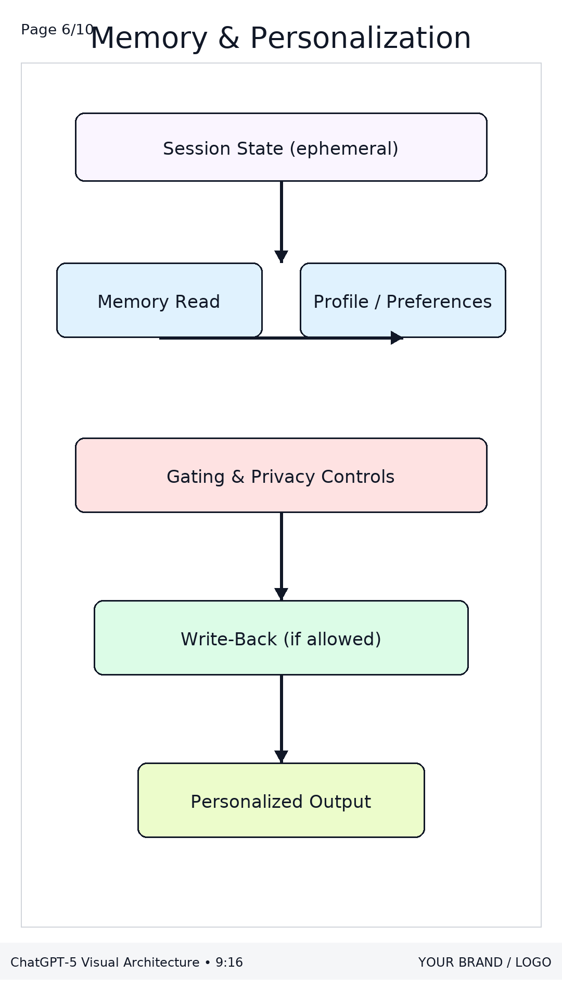
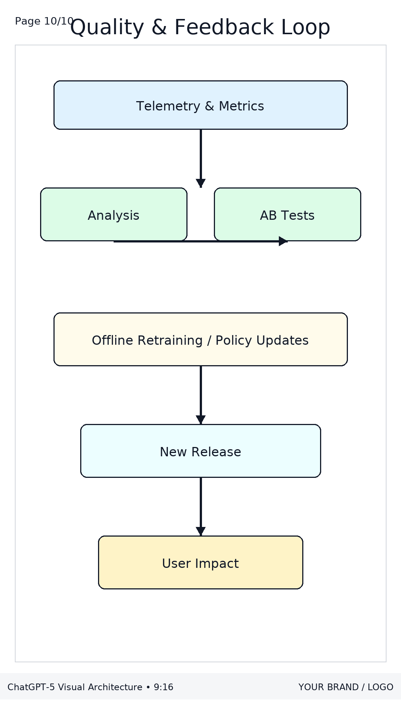

# ChatGPT-5 Architecture: A Visual & Conceptual Guide  

This repository provides a **visual walkthrough of ChatGPT-5’s architecture**, broken into different system layers. Each diagram below is followed by a **detailed explanation in human-friendly language**, so students, developers, or AI enthusiasts can understand how everything fits together.  

---

## 1. System Overview  
  

This is the **high-level blueprint** of ChatGPT-5.  

- **User → Client UI**: The conversation begins when a user types (or speaks) something into the interface (chat app, API, or UI).  
- **Orchestrator**: Acts like the brain’s coordinator. It routes the request, builds context, and decides what parts of the system to involve.  
- **Safety Layer**: A shield that checks inputs and outputs for harmful or restricted content.  
- **Tools & APIs**: If the model needs extra info (e.g., search, code execution, or database queries), the orchestrator can call these.  
- **GPT-5 Transformer**: The core model (multimodal, function-calling enabled). It interprets, reasons, and generates answers.  
- **Retrieval (RAG)**: If external knowledge is needed, retrieval pulls data from vector databases or knowledge sources.  
- **Memory/Profile**: Stores personalization data — like remembering your name, style preferences, or past context.  
- **Streaming Response**: The output is generated and streamed token by token back to the user for a smooth experience.  

---

## 2. Inputs → Normalization → Tokens  
  

ChatGPT-5 doesn’t just understand text. It processes **text, images, and audio** inputs.  

1. **Encoders**: Each input type is first converted into machine-understandable form:  
   - Text → tokenized  
   - Image → vision embeddings  
   - Audio → speech embeddings  
2. **Context Packer**: Manages the limited context window by truncating, compressing, and optimizing what goes into the model.  
3. **Safety Prefilter**: Removes PII (personally identifiable information) or screens for policy-violating content.  
4. **Tokens/Embeddings → Model**: Finally, everything is turned into tokens/embeddings and passed to the model.  

---

## 3. Retrieval-Augmented Generation (RAG)  
  

When the model doesn’t know something, it uses **RAG** to fetch external knowledge.  

- **Query Understanding**: Figures out what to look for.  
- **Retriever + Vector DB/Search**: Finds relevant documents.  
- **Relevance Scoring**: Removes duplicates and ensures grounding in facts.  
- **Prompt Builder**: Combines the retrieved knowledge with system instructions and user query.  
- **Model Input Context**: Sent to GPT-5 for reasoning.  

This is how the model stays **factual and up-to-date**.  

---

## 4. Transformer Core (Conceptual)  
  

At the heart of GPT-5 lies a **transformer stack**.  

- **Stack of N Blocks**: Multiple transformer layers stacked together.  
- Each block contains:  
  - Multi-Head Attention (focuses on relevant info)  
  - MLP (feedforward networks for reasoning)  
  - Residual + Norm (helps stability and efficiency)  
- **KV Cache**: Stores past key/values for fast inference.  
- **Speculative Decoding**: Speeds up generation by predicting multiple tokens ahead.  
- **Logits → Tokens**: Raw model outputs are converted into actual words (streamed back).  

---

## 5. Tool Use & Function Calling  
  

GPT-5 can **use external tools** like a developer calling functions.  

1. **Planner**: Decides which tools to use.  
2. **Tool Calls**: Executes external functions or APIs.  
3. **Result Parser + Re-plan**: Reads results, decides if another call is needed.  
4. **Grounded Answer Draft**: Builds the answer using results.  
5. **Safety Check → Stream**: Ensures output is safe before streaming.  

---

## 6. Memory & Personalization  
  

Unlike older models, GPT-5 has **long-term personalization**.  

- **Session State**: Keeps temporary context.  
- **Memory Read & Profile**: Looks up user preferences.  
- **Gating & Privacy Controls**: Ensures memory use is ethical and safe.  
- **Write-Back (if allowed)**: Updates the memory with new info.  
- **Personalized Output**: Tailors responses to you.  

---

## 7. Safety & Policy Enforcement  
  

Safety is built into multiple layers:  

1. **Prefilter**: Scans inputs.  
2. **Policy Classifiers**: Checks for sensitive content (safety, PII, disallowed material).  
3. **Mitigations**: Refuses, redacts, or reroutes unsafe queries.  
4. **Output Filter**: Adds watermarking/logging.  
5. **Human Feedback Loops**: Improves filters over time.  

---

## 8. Training (Illustrative)  
  

Training GPT-5 happens in phases:  

- **Pretraining Data + Base Model**: Large-scale unsupervised learning.  
- **Supervised Fine-Tuning (SFT)**: Human-labeled examples.  
- **RLHF / DPO**: Reinforcement learning with human preferences.  
- **Evals & Red-Team Gates**: Safety testing before release.  
- **Deployable Checkpoint**: The final production-ready model.  

---

## 9. Inference & Scaling  
  

When millions of users query GPT-5 simultaneously, **scaling is key**.  

- **Request Router**: Distributes requests.  
- **Batching + KV Cache**: Improves efficiency.  
- **Speculative/Assisted Decoding**: Speeds up response.  
- **Sharding + Autoscaling**: Distributes load across servers.  
- **Streaming to Client**: Ensures smooth user experience.  

---

## 10. Quality & Feedback Loop  
  

The system continuously improves via feedback:  

- **Telemetry & Metrics**: Track performance.  
- **Analysis & A/B Tests**: Test new improvements.  
- **Offline Retraining/Policy Updates**: Refine the model.  
- **New Release → User Impact**: Updates rolled out to users.  

This ensures GPT-5 keeps **getting smarter, safer, and more useful** over time.  

---

✨ That’s the **complete guided tour of ChatGPT-5’s architecture**!  
This repo is a mix of **diagrams + explanations** so learners can understand both the **visual flow** and the **underlying concepts**.  
"""
